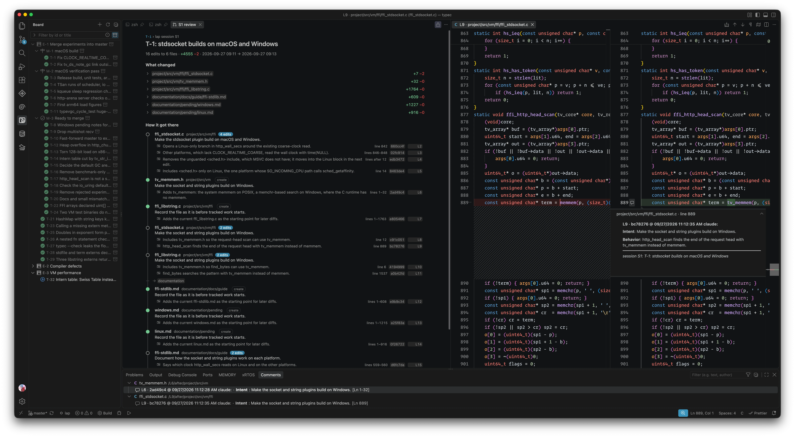
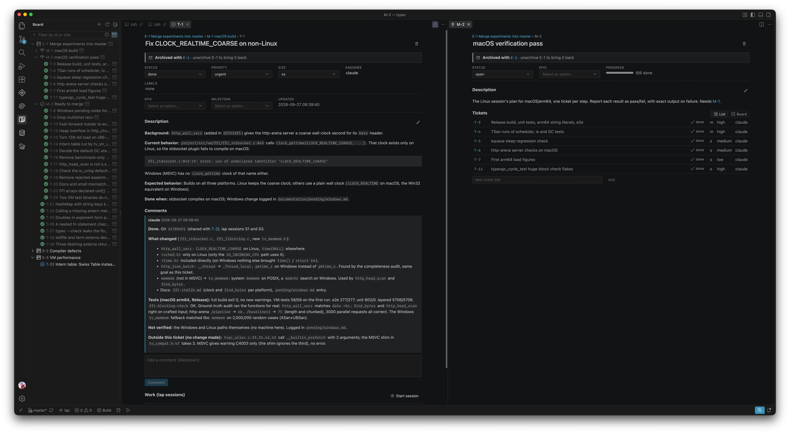
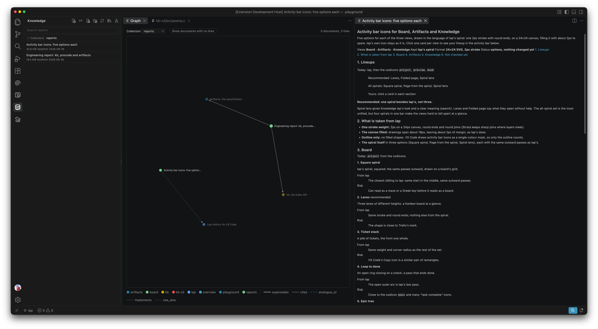
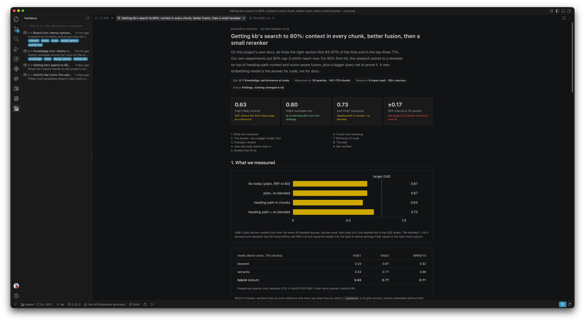

# progressive code
  
  
`procode` is a set of (very opinionated) tools for working alongside AI coding
agents. It includes CLIs and MCP servers the agent uses, and a VS Code
extension, **procode**, for you to follow along.

These tools can generally be used with any agent (or human), but only Claude Code is
tested.

This repository in itself, is written with claude code, using this extension, 
so you can clone it and open it in vscode to see how it looks like.

##  Lap

Lap is an edit recorder. Like git, lap records changes, but its goal is to
capture not only the change, but also the intent behind it and the behavior
it gives the code. Every edit an agent makes is its own commit, grouped into
sessions, so you can come back later and see what happened and why. A new
file is committed in parts too (`--lines` picks each part, in any order), so a large
one never lands as a single unexplained blob.

`lap` is available as a CLI and as an agent skill that teaches the agent
how to use it. To install the skills (`lap`, `kb`, `tickets` and `techdocs`) in a
project, run **procode: Add Skills for Claude Code** in VS Code: it adds the
ones you pick to the project's `.claude/skills/`, never touching other
skills and asking before it replaces a copy of its own that differs. Or copy
the folders in [.claude/skills/](.claude/skills/) by hand (into
`~/.claude/skills/` for every project). They follow the
[Agent Skills spec](https://agentskills.io/specification), each naming what it
needs to run in its `compatibility` line; `npm test` checks the spec's rules
(`scripts/skills.test.mjs`: names, lengths, and links that stay in the
skill's folder).

Agents working in parallel each get a folder of their own — a git worktree
or a copy — made a **lap branch** of the first folder (`lap branch start`),
with its own line of history. Merging back goes in one order: `git merge`
brings the code — and the branch's history with it — then `lap merge`
adopts that history: every commit it can place lands in the first folder's
history, linked to its original. A file where both sides changed the same
lines differently stops there and is left to commit by hand; a change both
sides made alike is simply already done. Branch folders can start branches
of their own, and a branch of a branch can be merged into its parent
branch or straight into the first folder.

The extension's **Lap History** view renders the sessions and their changes
inside VS Code.



More in [lap's README](cli/lap-cli/README.md)

##  Coboard

Coboard is a very simple board of epics, milestones and tickets. It is meant
to be a more robust alternative to Claude's plan: you can always keep track
of the progress, comment on the tickets, and have better visibility. Agents
work it through its MCP server; you work it in the extension's **Board**
view. Finished work is archived from a row's right-click: **Archive** takes
it (and what is under it) out of the lists at once, **Archive with Note**
asks why first; **Unarchive** brings it back. An epic whose milestones and
own tickets are all done shows an archive button on hover, set apart from
the new-item buttons, that archives it at once.

Coboard works perfectly fine without lap. But if lap is available, a ticket
also shows the sessions (groups of changes) made under it, for a smoother
review.

A project has one board, whatever folder you work in. In a lap branch
folder, coboard works the parent folder's board (lap recorded where the
parent is), never the branch's git copy of it — if the parent folder has
moved, it says so instead; anywhere else, set `COBOARD_DIR` for the MCP
server, or **Board › Board Folder** in VS Code, to another folder's board (a
relative path is taken from the folder worked in). Writes take the board's
lock, so agents in several folders share it safely.



The [tickets skill](.claude/skills/tickets/SKILL.md) is the loop used in
this repository (board, lap and git together); adapt it for yours.

##  KB (Knowledge Base)

kb is a local knowledge base of documentation, source and papers, that
agents and you can both search and cite. It keeps one store per workspace
in `.kb/`, found by walking up like `.git`, with keyword search, semantic
search when an embedding model is installed (see [Build and install](#build-and-install)),
provenance for every passage, and links between documents. Nothing leaves
your machine.

Agents use it through the `kb` MCP server: research filed once is searched
from disk the next time, instead of fetched again. You browse and search it
in the extension's **Knowledge** view — it opens on the collections, a
collection opens its documents (a page at a time, with their size, type,
fetch date and description), and the search bar searches the store or the
open collection — and see how documents link to each other in its graph.



##  techdocs

techdocs pages are what an agent publishes for you to read in the editor:
reports, comparisons, findings, anything with a table or a chart. They are
stored in `.techdocs/` and published through the `techdocs` MCP server,
and the extension's **techdocs** view opens them in your VS Code theme.
Each page carries a few keywords the agent gives it when publishing, shown
in the view and used to find pages on one topic (`techdocs_list {keyword}`).
The view has the same filter bar as the Board and Lap History: type to match
a page's id, title, description or keywords, or pick keywords under its
chevron.
The format is in [specs/techdocs.md](specs/techdocs.md). These are almost
identical to claude artifacts, except they stay local to your project.



techdocs pages are meant to live and be rendered in your vscode. They are HTML documents
that adjust to the user theme since all UI in this repo uses  [baukasten](https://github.com/TypeFox/baukasten).

## Install

Download the `.vsix` for your platform from the repository's
[Releases](https://github.com/praisethemoon/procode/releases) and install it
with **Extensions: Install from VSIX…**: `darwin-arm64` (Apple silicon),
`darwin-x64` (Intel Mac), `linux-x64` / `linux-arm64`, `alpine-x64` /
`alpine-arm64`, `win32-x64` / `win32-arm64`. Each includes the `lap` and `kb`
CLIs; there is nothing else to install. Then set up Claude Code in your
project (step 3 of [Build and install](#build-and-install)).

`procode-<version>.vsix` is for any other platform and has no CLIs: build
them as below. The rest of this section, and the next, are for building from
source.

## Requirements

For the CLIs, a C11 compiler and CMake 3.16+:

- **macOS:** clang from the Xcode Command Line Tools
  (`xcode-select --install`), and CMake (`brew install cmake`).
- **Linux:** gcc or clang, make and CMake
- **Windows:** Visual Studio 2022 (or its Build Tools) with the
  *Desktop development with C++* workload, which includes MSVC and CMake.

For the packages and the extension: Node.js 20+ with npm (vsce, which
packages the extension, needs 20), and VS Code 1.101+.

Development happens on macOS; the CLIs are also built on Windows with MSVC.

**The tests need git.** lap's branch and merge tests — the end-to-end
branch scenarios and the generated merge cases — build real repositories
with git; without it they are skipped, and **a skip counts as a pass**: a
run on a machine without git is green without having tested any merge, so
CI must have git installed. lap itself never needs git.

## Build and install

From the repository root, in this order. The extension built here is the
package without CLIs, so it and its MCP servers run the ones you build,
from `PATH` or wherever the settings point.

1. **The CLIs**, with CMake. On macOS and Linux, into `/usr/local/bin`:

   ```sh
   cmake -B build -DCMAKE_BUILD_TYPE=Release
   cmake --build build
   ctest --test-dir build          # both CLIs' suites
   sudo cmake --install build
   ```

   `ctest` needs git for lap's branch and merge tests: without it they are
   skipped and the run is still green (see **The tests need git** under
   Requirements).

   `-DCMAKE_BUILD_TYPE=Release` matters: without it the build is
   unoptimised, and kb's semantic search is much slower. Add
   `--prefix <dir>` to the install for somewhere other than `/usr/local`.

   On Windows, from a Developer PowerShell for Visual Studio:

   ```powershell
   cmake -B build
   cmake --build build --config Release
   ctest --test-dir build -C Release

   # Change the folder (prefix) in the next command, if you don't like that path, just an example
   cmake --install build --config Release --prefix C:\tools\procode
   ```

   Then add `C:\tools\procode\bin` to `PATH`. Each CLI also builds alone
   with `make` in its own directory.

2. **The packages and the extension**, with npm; one `.vsix` for every
   platform:

   ```sh
   npm run setup                   # npm install, then build every package
   npm test                        # every package's tests
   npm run package --workspace combined
   code --install-extension packages/combined/procode-0.1.0.vsix
   ```

   Then reload the VS Code window. If the CLIs are not on `PATH`, point the
   settings **Knowledge › Cli Path** and **Board › Lap Path** at them. When
   one cannot be found, procode says so once per window, and again when VS
   Code is about to start the MCP server that needs it: kb's server is then
   not started (all of its tools need `kb`), while coboard's still starts
   (only its lap sessions need `lap`).

   procode keeps `lap` and `kb` in `~/.procode/bin`, the path its skills
   tell agents to use: copies of the ones a platform package ships, or
   links to yours (a setting's, else the one on `PATH`). It refreshes them
   when VS Code starts, and never deletes anything there: after
   uninstalling procode, delete `~/.procode` yourself if you like.

   Some package tests drive the real CLIs. They use `$LAP_BIN` and
   `$KB_BIN` when set, else the ones built under `build/` (or by `make`),
   else the ones on `PATH`, and skip when there are none.

3. **Agents.** VS Code's agent gets the MCP servers on its own; a change to
   **Knowledge › Cli Path**, **Board › Lap Path**, **Board › Board Folder**
   or the workspace folders reaches the servers it starts next, without a
   reload (one already running keeps what it started with).

   For Claude Code, once per project:

   1. Open the project's folder in VS Code.
   2. Open the Command Palette (<kbd>Cmd</kbd>+<kbd>Shift</kbd>+<kbd>P</kbd>
      on macOS, <kbd>Ctrl</kbd>+<kbd>Shift</kbd>+<kbd>P</kbd> elsewhere) and
      run **procode: Set Up MCP for Claude Code**. It adds `coboard`, `kb`
      and `techdocs` to the project's `.mcp.json` and keeps any other
      servers.
   3. Run **procode: Add Skills for Claude Code** the same way. It adds the
      skills that teach Claude to use the tools to the project's
      `.claude/skills/`: lap, kb and techdocs are ticked; tickets is this
      repository's workflow, so it is left for you to pick.
   4. Start Claude Code in the project, or restart it (or run `/mcp`), and
      approve the project's servers when it asks.

   When a new build is installed, procode notices a `.mcp.json` that still
   runs the old servers, and skills older than the ones it ships, and
   offers to update them; restart Claude Code afterwards.

4. **Stores.** `lap init`, `kb init` in the project root. The board and
   `.techdocs/` are created on first write.

**kb's embedding model** (for semantic search; keyword search works
without it) lives in `~/.kb/models/`, shared by every workspace. kb only
reads it and never downloads anything. The default, gte-modernbert-base, is
converted from its Hugging Face weights by
`cli/kb-cli/tools/modernbert/convert.py` (steps and checksums in
`MODERNBERT.md` beside it). nomic-embed-text-v1.5 can be used as it is:

```sh
mkdir -p ~/.kb/models && curl -fL -o ~/.kb/models/nomic-embed-text-v1.5.Q4_K_M.gguf \
  https://huggingface.co/nomic-ai/nomic-embed-text-v1.5-GGUF/resolve/main/nomic-embed-text-v1.5.Q4_K_M.gguf
shasum -a 256 ~/.kb/models/nomic-embed-text-v1.5.Q4_K_M.gguf
# d4e388894e09cf3816e8b0896d81d265b55e7a9fff9ab03fe8bf4ef5e11295ac
```

**Without VS Code**, point any MCP client at the servers directly, started
inside the project:

```json
{
  "mcpServers": {
    "coboard":   { "command": "/path/to/procode/packages/coboard/bin/coboard-mcp" },
    "kb":        { "command": "/path/to/procode/packages/kb-mcp/bin/kb-mcp", "env": { "KB_BIN": "kb" } },
    "techdocs":  { "command": "/path/to/procode/packages/techdocs/bin/techdocs-mcp" }
  }
}
```

## Releasing

Before a release, run **ci** by hand (Actions → ci → Run workflow,
[ci.yml](.github/workflows/ci.yml)): it builds and tests both CLIs with CMake
and `ctest`, then every package with `npm test`, on macOS, Linux and Windows,
and on Linux arm64 too once the repository is public (GitHub gives arm64
runners only to public repositories), in the same Release build a release
uses. A separate job runs both CLIs' suites under AddressSanitizer and
UndefinedBehaviorSanitizer, with every report fatal.
It does not run on push, so no Actions minutes are spent between releases;
the release itself tests the CLIs it ships, but not the packages.

A release is a version tag. Set `version` in
`packages/combined/package.json`, commit, then tag and push it:

```sh
git tag v0.2.0 && git push origin v0.2.0
```

[release.yml](.github/workflows/release.yml) then builds lap and kb for
every platform (macOS as one universal binary; Linux static against musl,
which also serves Alpine; Windows with the C runtime linked in), packages
one `.vsix` per platform with them inside, plus `procode-<version>.vsix`
without CLIs, and attaches them all to a GitHub release. The tag must match
the version, or nothing is released. The arm64 Linux and Windows builds
need GitHub's arm64 runners, which only public repositories get: a private
one releases without them. Run by hand (Actions → release → Run workflow),
it builds the packages as the run's artifacts and releases nothing.

Publishing to the VS Code Marketplace and Open VSX is a separate step,
started by hand once a release has been tried: Actions → publish → Run
workflow, with the tag and the stores to publish to
([publish.yml](.github/workflows/publish.yml)). It builds nothing; it
uploads that GitHub release's own `.vsix` files, checks each is a package of
the tag's version first, and skips a version a store already has, so running
it again after a failure is safe. Once, beforehand:

- **Marketplace:** create the `praisethemoon` publisher at
  [marketplace.visualstudio.com/manage](https://marketplace.visualstudio.com/manage),
  make an Azure DevOps personal access token with the **Marketplace ›
  Manage** scope, and save it as the repository secret `VSCE_PAT`.
- **Open VSX:** sign in at [open-vsx.org](https://open-vsx.org) with GitHub,
  create the namespace (`npx ovsx create-namespace praisethemoon -p <token>`),
  and save the access token as the repository secret `OVSX_PAT`.

A store ticked without its secret stops the run before anything is uploaded.

One platform's package, locally, from CLIs you built:

```sh
npm run package --workspace combined -- --target darwin-arm64 --bin <folder with lap and kb>
```

## How the pieces meet

A ticket's work is a lap session tagged with it:
`lap session start "T-12: fix the parser" --meta ticket=T-12`. The ticket's
tab and `board_sessions` then list that session's commits, grouped by
intent. A commit cites another by its hash (`#fa9cebd`), and the views turn
those into links. The `tickets` skill spells out the whole loop.

## Layout

```
cli/        lap-cli, kb-cli                                     C11, make or CMake
packages/   coboard, techdocs, kb-js, kb-mcp,
            lap-vscode, index-vscode, coboard-vscode,
            techdocs-vscode, combined                          TypeScript, one npm workspace
```

## Limitations

> [!WARNING]
> **Parallel work needs lap branches and one board.** lap's history
> (`.lap/log/`) and the board (`.coboard/log.jsonl`) are append-only logs
> committed to git. Two git branches of *one folder* that both record lap
> commits, or both change the board, conflict on those logs when merged,
> and no resolution keeps both sides: each has handed out the same next ids
> (`L…`, `S…`, `T-…`), and interleaving lap's lines breaks its hash chain.
>
> So give each line of work its own folder as a lap branch (its history
> goes in its own chunk files, and `lap merge` adopts it), and keep one
> board: branch folders use their parent's.

**Merging the parent into a branch is not supported.** Never `git merge`
the parent (main) into a branch folder to stay current: its changes would
show as the branch's own pending edits and, if committed, come back to the
parent as branch work. To take in the parent's newer work, merge the
branch back, then start a fresh branch.

lap's other limits (it cannot restore files, it takes changes git makes
for yours, renames are two commits) are in
[its README](cli/lap-cli/README.md#limitations).

## Parts

| part | path | what it is |
|---|---|---|
| **lap** | [cli/lap-cli/](cli/lap-cli/) | The edit recorder. It sits below git and never touches it. C11, no dependencies. |
| **kb** | [cli/kb-cli/](cli/kb-cli/) | The knowledge base: one store per workspace in `.kb/`, keyword and semantic search, provenance and links. C11. |
| **coboard** | [packages/coboard/](packages/coboard/) | The board: an append-only `.coboard/log.jsonl` (commit it) and an MCP server. |
| **techdocs** | [packages/techdocs/](packages/techdocs/) | The `.techdocs/` store and its MCP server. [Format](specs/techdocs.md) |
| **kb-js**, **kb-mcp** | [packages/kb-js/](packages/kb-js/), [packages/kb-mcp/](packages/kb-mcp/) | A typed client for the kb CLI, and kb as MCP tools. |
| **procode** | [packages/combined/](packages/combined/) | The VS Code extension: Lap History, Knowledge, the Board and techdocs, with the coboard, kb and techdocs MCP servers inside. It is built from `packages/*-vscode`. |
| **skills** | [.claude/skills/](.claude/skills/) | How agents work here: `lap`, `kb`, `tickets` (board, lap and git together) and `techdocs`. Copy them into your own `.claude/skills/` to use them elsewhere. |

## License

MIT, see [LICENSE](LICENSE). Copyright (c) 2026 Soulaymen Chouri.
