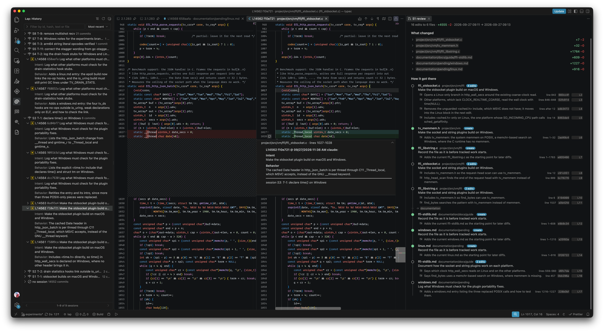
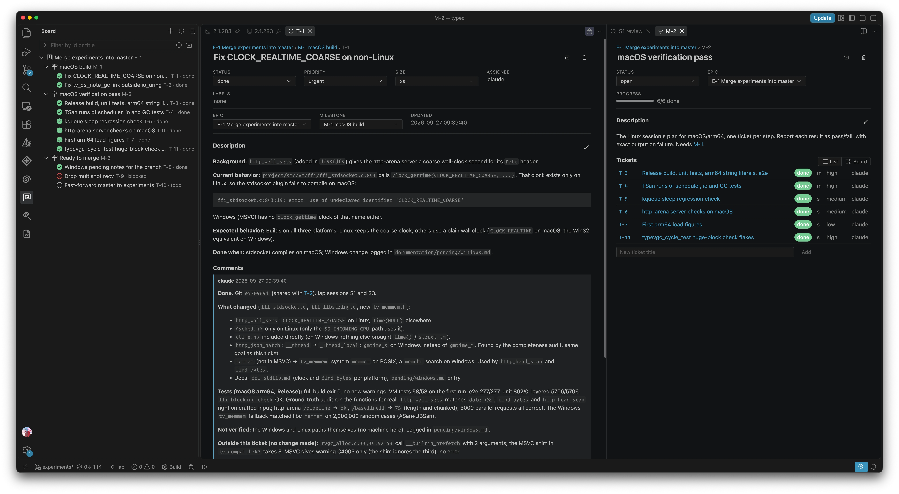

# progressive code
  
  
procode is a set of (very opinionated) tools for working alongside AI coding
agents. It includes CLIs and MCP servers the agent uses, and a VS Code
extension, **procode**, for you to follow along.

These tools can generally be used with any agent, but only Claude Code is
tested.

## Lap

Lap is an edit recorder. Like git, lap records changes, but its goal is to
capture not only the change, but also the intent behind it and the behavior
it gives the code. Every edit an agent makes is its own commit, grouped into
sessions, so you can come back later and see what happened and why.

`lap` is available as a CLI and as an agent skill that teaches the agent
how to use it. To install the skill, copy
[cli/lap-cli/skill/lap/](cli/lap-cli/skill/lap/) into your project's
`.claude/skills/lap/` (or `~/.claude/skills/lap/` for every project).

The extension's **Lap History** view renders the sessions and their changes
inside VS Code.



More in [lap's README](cli/lap-cli/README.md) and its [SPEC](cli/lap-cli/SPEC.md).

## Coboard

Coboard is a very simple board of epics, milestones and tickets. It is meant
to be a more robust alternative to Claude's plan: you can always keep track
of the progress, comment on the tickets, and have better visibility. Agents
work it through its MCP server; you work it in the extension's **Board**
view.

Coboard works perfectly fine without lap. But if lap is available, a ticket
also shows the sessions (groups of changes) made under it, for a smoother
review.



The [tickets skill](.claude/skills/tickets/SKILL.md) is the loop used in
this repository (board, lap and git together); adapt it for yours.

## KB (Knowledge Base)

kb is a local knowledge base of documentation, source and papers, that
agents and you can both search and cite. It keeps one store per workspace
in `.kb/`, found by walking up like `.git`, with keyword search, semantic
search when an embedding model is installed (see [Install](#install)),
provenance for every passage, and links between documents. Nothing leaves
your machine.

Agents use it through the `kb` MCP server: research filed once is searched
from disk the next time, instead of fetched again. You browse and search it
in the extension's **Knowledge** view. The contract is in
[specs/index-api.md](specs/index-api.md).

## Artifacts

Artifacts are pages an agent publishes for you to read in the editor:
reports, comparisons, findings, anything with a table or a chart. They are
stored in `.artifact/` and published through the `artifacts` MCP server,
and the extension's **Artifacts** view opens them in your VS Code theme.
The format is in [specs/artifacts.md](specs/artifacts.md). These are almost
identical to claude artifacts, except they stay local to your project.

## Requirements

For the CLIs, a C11 compiler and CMake 3.16+:

- **macOS:** clang from the Xcode Command Line Tools
  (`xcode-select --install`), and CMake (`brew install cmake`).
- **Linux:** gcc or clang, make and CMake
- **Windows:** Visual Studio 2022 (or its Build Tools) with the
  *Desktop development with C++* workload, which includes MSVC and CMake.

For the packages and the extension: Node.js 18+ with npm, and VS Code
1.101+.

Development happens on macOS; the CLIs are also built on Windows with MSVC.

## Build and test

From the repository root, the CLIs with CMake, then the packages with npm:

```sh
cmake -B build -DCMAKE_BUILD_TYPE=Release
cmake --build build
ctest --test-dir build    # both CLIs' suites

npm run setup             # npm install, then build every package
npm test                  # every package's tests
```

On Windows, add `--config Release` to the build and `-C Release` to ctest.
Each CLI also builds alone with `make` in its own directory.

Some package tests drive the real CLIs. They use `$LAP_BIN` and `$KB_BIN`
when set, else the ones built under `build/` (or by `make`), else the ones
on `PATH`, and skip when there are none.

Run mutation sweeps only with `HOME` and `TMPDIR` pointing at throwaway
directories: some tests feed shell syntax to code whose job is never to run
it.

## Install

In this order: the extension and its MCP servers run the CLIs from `PATH`.

1. **The CLIs**, built with CMake from the repository root.

   On macOS and Linux, into `/usr/local/bin`:

   ```sh
   cmake -B build -DCMAKE_BUILD_TYPE=Release
   cmake --build build
   sudo cmake --install build
   ```

   `-DCMAKE_BUILD_TYPE=Release` matters: without it the build is
   unoptimised, and kb's semantic search is much slower. Add
   `--prefix <dir>` to the install for somewhere other than `/usr/local`.

   On Windows, from a Developer PowerShell for Visual Studio:

   ```powershell
   cmake -B build
   cmake --build build --config Release
   ```

   This gives `build\cli\lap-cli\Release\lap.exe` and
   `build\cli\kb-cli\Release\kb.exe`. Put them on `PATH`, for example with
   `cmake --install build --config Release --prefix C:\tools\procode` and
   then adding `C:\tools\procode\bin` to `PATH`.

2. **The extension**, one `.vsix` for every platform:

   ```sh
   npm run package --workspace combined
   code --install-extension packages/combined/procode-0.1.0.vsix
   ```

   Then reload the VS Code window. If the CLIs are not on `PATH`, point the
   settings **Knowledge › Cli Path** and **Board › Lap Path** at them.

3. **Agents.** VS Code's agent gets the MCP servers on its own. For Claude
   Code, run **procode: Set Up MCP for Claude Code** in a project: it adds
   `coboard`, `kb` and `artifacts` to the project's `.mcp.json` and keeps
   any other servers. After installing a new build, restart Claude Code (or
   run `/mcp`) so it starts the new servers.

4. **Stores.** `lap init`, `kb init` in the project root. The board and
   `.artifact/` are created on first write.

**kb's embedding model** (for semantic search; keyword search works
without it) lives in `~/.kb/models/`, shared by every workspace. kb only
reads it and never downloads anything. The default, gte-modernbert-base, is
converted from its Hugging Face weights by
`cli/kb-cli/tools/modernbert/convert.py` (steps and checksums in
`MODERNBERT.md` beside it). nomic-embed-text-v1.5 can be used as it is:

```sh
mkdir -p ~/.kb/models && curl -fL -o ~/.kb/models/nomic-embed-text-v1.5.Q4_K_M.gguf \
  https://huggingface.co/nomic-ai/nomic-embed-text-v1.5-GGUF/resolve/main/nomic-embed-text-v1.5.Q4_K_M.gguf
shasum -a 256 ~/.kb/models/nomic-embed-text-v1.5.Q4_K_M.gguf
# d4e388894e09cf3816e8b0896d81d265b55e7a9fff9ab03fe8bf4ef5e11295ac
```

**Without VS Code**, point any MCP client at the servers directly, started
inside the project:

```json
{
  "mcpServers": {
    "coboard":   { "command": "/path/to/procode/packages/coboard/bin/coboard-mcp" },
    "kb":        { "command": "/path/to/procode/packages/kb-mcp/bin/kb-mcp", "env": { "KB_BIN": "kb" } },
    "artifacts": { "command": "/path/to/procode/packages/artifacts/bin/artifacts-mcp" }
  }
}
```

## How the pieces meet

A ticket's work is a lap session tagged with it:
`lap session start "T-12: fix the parser" --meta ticket=T-12`. The ticket's
tab and `board_sessions` then list that session's commits, grouped by
intent. A commit cites another by its hash (`#fa9cebd`), and the views turn
those into links. The `tickets` skill spells out the whole loop.

## Layout

```
cli/        lap-cli, kb-cli                                     C11, make or CMake
packages/   coboard, artifacts, kb-js, kb-mcp,
            lap-vscode, index-vscode, coboard-vscode,
            artifacts-vscode, combined                          TypeScript, one npm workspace
specs/      the kb contract and the artifact format
```

## Limitations

> [!WARNING]
> **lap and board histories do not merge across git branches.** Both are
> append-only logs committed to git (`.lap/log.jsonl`, `.coboard/log.jsonl`).
> If two branches both record lap commits or change the board, merging them
> conflicts on that log, and no resolution keeps both sides: each branch
> has handed out the same next ids (`L…`, `S…`, `T-…`), and interleaving
> lap's lines breaks its hash chain. Keep one side's log and discard the
> other's.
>
> To avoid it, record lap sessions and board changes on one line of work,
> or keep `.lap/` out of git so it stays on one machine.

lap's other limits (it cannot restore files, it takes changes git makes
for yours, renames are two commits) are in
[its README](cli/lap-cli/README.md#limitations).

## Parts

| part | path | what it is |
|---|---|---|
| **lap** | [cli/lap-cli/](cli/lap-cli/) | The edit recorder. It sits below git and never touches it. C11, no dependencies. [SPEC](cli/lap-cli/SPEC.md) |
| **kb** | [cli/kb-cli/](cli/kb-cli/) | The knowledge base: one store per workspace in `.kb/`, keyword and semantic search, provenance and links. C11. [Contract](specs/index-api.md) |
| **coboard** | [packages/coboard/](packages/coboard/) | The board: an append-only `.coboard/log.jsonl` (commit it) and an MCP server. |
| **artifacts** | [packages/artifacts/](packages/artifacts/) | The `.artifact/` store and its MCP server. [Format](specs/artifacts.md) |
| **kb-js**, **kb-mcp** | [packages/kb-js/](packages/kb-js/), [packages/kb-mcp/](packages/kb-mcp/) | A typed client for the kb CLI, and kb as MCP tools. |
| **procode** | [packages/combined/](packages/combined/) | The VS Code extension: Lap History, Knowledge, the Board and Artifacts, with the coboard, kb and artifacts MCP servers inside. It is built from `packages/*-vscode`. |
| **skills** | [.claude/skills/](.claude/skills/) | How agents work here: `lap`, `tickets` (board, lap and git together) and `artifacts`. The lap skill is also in [cli/lap-cli/skill/](cli/lap-cli/skill/) for other projects. |

## License

MIT, see [LICENSE](LICENSE). Copyright (c) 2026 Soulaymen Chouri.
